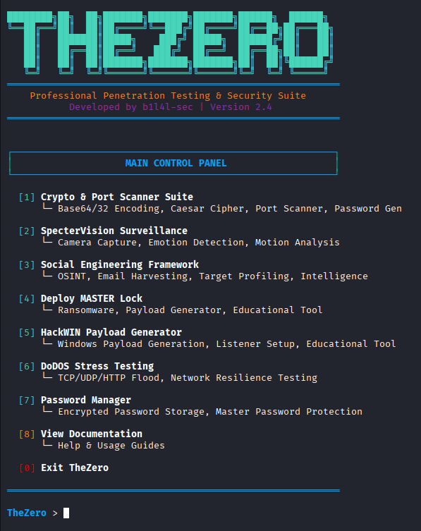
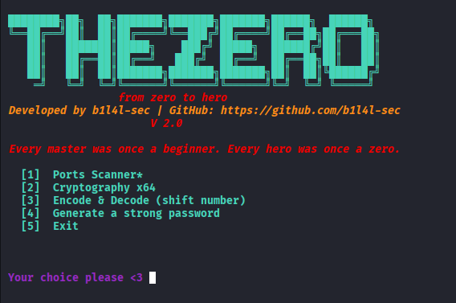
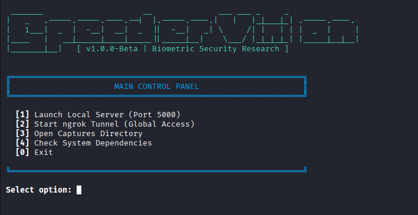
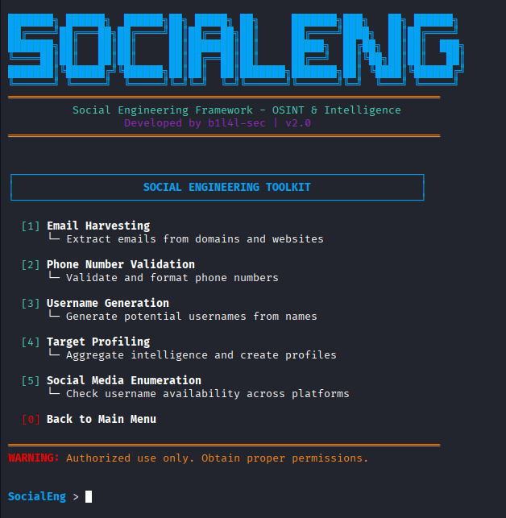
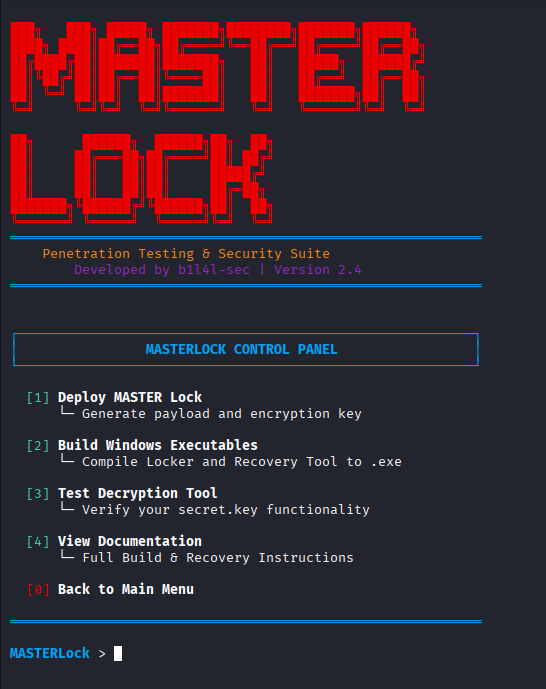
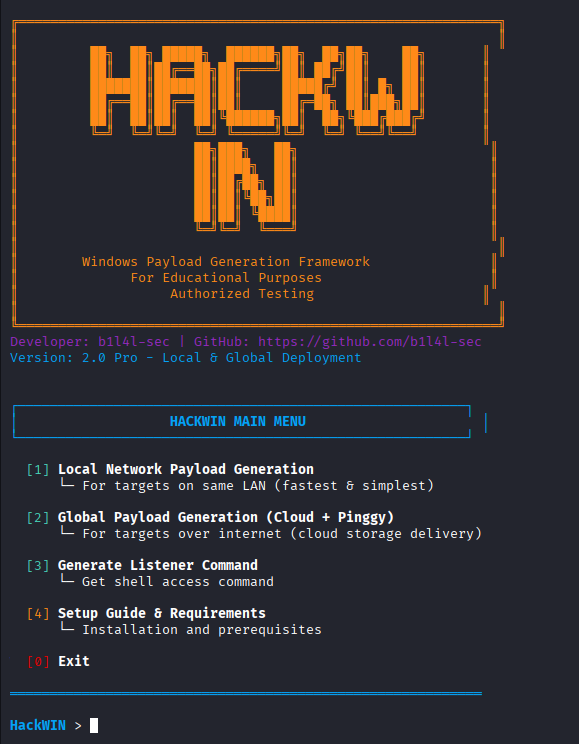
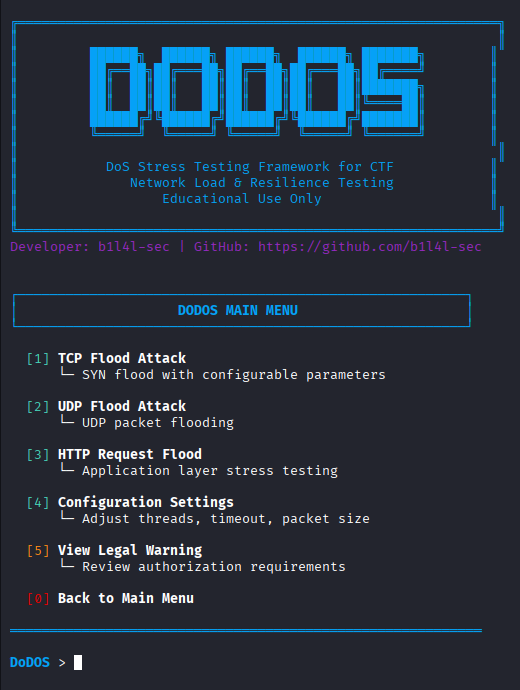
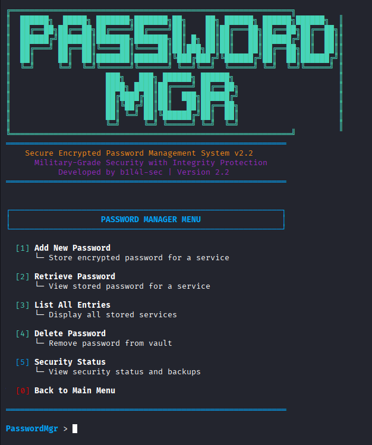

# TheZero - Offensive Security & OSINT Swiss Army Knife 🚀

**Author:** [b1l4l-sec](https://github.com/b1l4l-sec)  
**Version:** 2.0  
**Platforms:** Linux (Kali recommended), macOS, WSL  
**License:** Educational/Research Use Only

---

## Introduction

**TheZero** is a professional modular penetration testing & OSINT (Open Source Intelligence) framework for red teams, security researchers, and CTF competitors. Its goal is to streamline reconnaissance, credential and vault management, biometric surveillance, social engineering, and network/crypto operations into a single, streamlined toolkit.

> "Every master was once a beginner. Every hero was once a zero."  

---

## 🔥 Screenshots

### Main Interface


### Sub Tools Gallery

| Social Engineering Tool | Crypto & Port Scanner | Target Profiler |
|------------------------|----------------------|-----------------|
|  |  |  |

| Email Harvester | Phone Validator | Social Media Enum | Other Tools |
|-----------------|-----------------|-------------------|------------|
|  |  |  |  |

---

## Module Overview

### 1. PasswordManager
- Encrypted vaults with integrity checks.
- Salted hashing, secure key handling, and CLI utilities.

### 2. SocialEng (Social Engineering)
A comprehensive OSINT and social engineering suite for lawful security assessments.
- Email harvesting, phone validation, username generation, profiling, social media enumeration.
- Multi-format output: JSON/TXT and platform coverage.

### 3. Crypto & Port Scanner
- Open port scanning and network host analysis.
- Encode/decode tools for Base64/Base32.
- Colorful terminal UI.

### 4. SpecterVision (Biometric Surveillance Lab)
- CLI and Flask web interface.
- Automated camera frame capture, session management.
- Real-time emotion/motion detection with TensorFlow.js.

### 5. DoDOS – Network Stress Testing (CTF/Education Only!)
- For lawful, authorized scenarios only.

---

## 📦 Setup & Dependencies

To set up **all project dependencies, simply run**:

```bash
chmod +x setup.sh
./setup.sh
```

This script handles Python requirements, directories, and prepares all modules.

---

## Project Structure

```
TheZero/
├── PasswordManager/
├── SocialEng/
├── Crypto&portScan/
├── SpecterVision/
├── DoDOS/
├── setup.sh
├── TheZeroMainScreen.png
├── TheZeroSubTool1.png
├── TheZeroSubTool2.png
├── TheZeroSubTool3.png
├── TheZeroSubTool4.png
├── TheZeroSubTool5.png
├── TheZeroSubTool6.png
├── TheZeroSubTool7.png
└── ...
```

---

## 🚦 Legal & Ethical Usage

**Any misuse is strictly prohibited and may carry severe legal penalties. By using TheZero, you accept full responsibility for lawful, ethical use.**

---

## 🤝 Contributing & Community

PRs and suggestions welcome! Please open issues for bugs or feature requests.  
Connect via [GitHub](https://github.com/b1l4l-sec/TheZero).

## 👏 Credits

Made with ❤️ by [b1l4l-sec](https://github.com/b1l4l-sec) and inspired by the open-source community.

---

## Links
- **[SocialEng - Full Module Readme](SocialEng/README.md)**
- **[SpecterVision - Biometric Surveillance Docs](SpecterVision/readme.md)**
